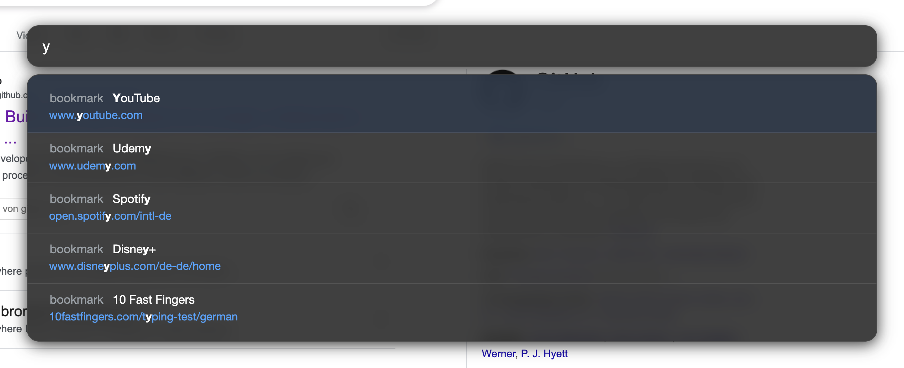

# Vomnibar Custom CSS 🔎

Custom css for the chrome extension "Vimium" and their vomnibar. The style is
inspired by the apple spotlight search.

## Usage

Go the `Vimium Options` page (By first clicking on the extension icon and then
on the `Options` link) and append the content of the `style.css` file to the
default content of the field `CSS for Vimium UI` :)

## Preview

